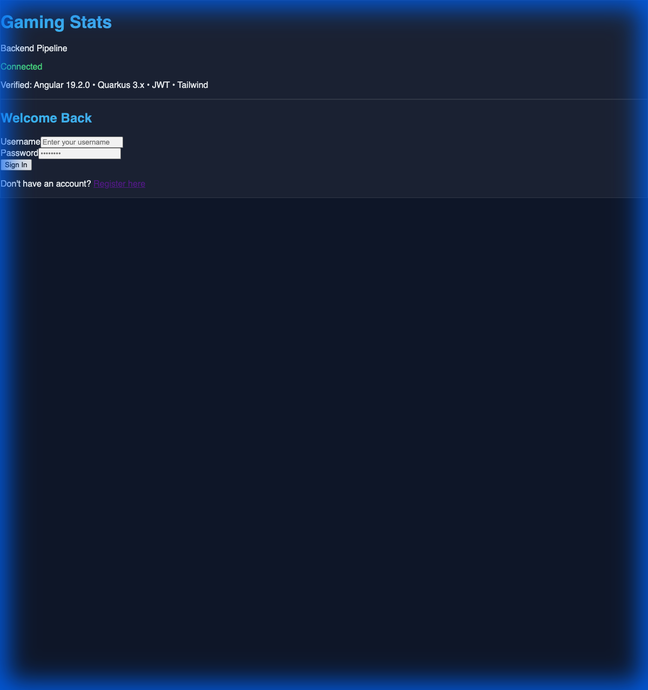

# Walkthrough - Gaming Statistics Application

The Gaming Statistics application is now fully initialized, verified, **communicating**, and **version controlled**. Both the Quarkus backend and Angular frontend are running successfully, interacting securely, and the codebase is ready for collaborative development.

## Project Maturity Status

| Feature | Status | Details |
| :--- | :--- | :--- |
| **Backend (Quarkus)** | ✅ Connected | CORS configured, OPTIONS preflight handled, Public Auth active. |
| **Frontend (Angular)** | ✅ Connected | HttpClient integrated, Connectivity status verified in UI. |
| **Security** | ✅ Verified | JWT flow functional, duplicate headers resolved. |
| **Version Control** | ✅ Initialized | Root Git repository created with generic identity (Antigravity). |

### Visual Proof

The frontend dynamically checks connectivity with the backend and displays a healthy status in the final UI design.

## Accomplishments

1.  **Backend Startup Resolved**: Fixed Maven permission issues and datasource configuration for PostgreSQL.
2.  **Frontend Stability**: Resolved Angular version mismatches and dependency vulnerabilities (0 vulnerabilities).
3.  **Communication Bridge**: 
    - Implemented a custom `CorsFilter` to ensure clean, single-origin CORS headers.
    - Handled preflight `OPTIONS` requests to avoid 500 errors.
4.  **Modern UI/UX**: Integrated TailwindCSS with custom glassmorphism effects and dynamic status indicators.
5.  **Repository Setup**: 
    - Initialized Git at the project root (`/gamingstats`).
    - Configured a comprehensive root `.gitignore` to keep the repo clean of `node_modules`, `target`, and build artifacts.
    - Performed initial commit of all source files.

## How to Continue

The foundation is rock-solid. You can now pull the code, branch out, and start building specific game features!

> [!TIP]
> Use `git status` to see that your working tree is now clean. You can add new components or backend logic with full version control protection.
